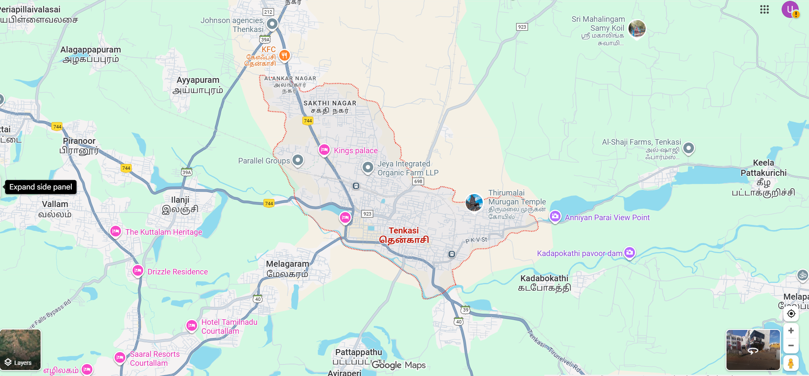
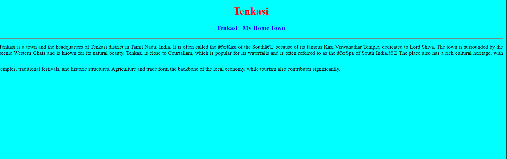

# Ex04 Places Around Me
## Date: 25/09/2025

## AIM
To develop a website to display details about the places around my house.

## DESIGN STEPS

### STEP 1
Create a Django admin interface.

### STEP 2
Download your city map from Google.

### STEP 3
Using ```<map>``` tag name the map.

### STEP 4
Create clickable regions in the image using ```<area>``` tag.

### STEP 5
Write HTML programs for all the regions identified.

### STEP 6
Execute the programs and publish them.

## CODE
---
map.html
 <html>
<head>
 <title>My City</title>
</head>
<body>
<h1 align="center">
<font color="red"><b>Tenkasi</b></font>
</h1>
<h3 align="center">
<font color="blue"><b>Udhaya Giri V (25015458)</b></font>
</h3>
<center>

<map name="MyCity">
<!-- Image Map Generated by http://www.image-map.net/ -->


<map name="image-map">
<area target="_blank" alt="Ilanji" title="Ilanji" href="ilangi.html" coords="387,457,459,503" shape="rect">
<area target="_blank" alt="Thirumalai kovil" title="Thirumalai kovil" href="tmt.html" coords="1074,451,1154,503" shape="rect">
<area target="_blank" alt="Piranoor" title="Piranoor" href="piranoor.html" coords="127,312,239,360" shape="rect">
<area target="_blank" alt="Tenkasi" title="Tenkasi" href="tenkasi.html" coords="858,504,1047,593" shape="rect">
<area shape="rect" coords="100,100,900,900" href="home.html" title="My Home Town">
</map>
</center>
</body>
</html>

ilanji.html
<!DOCTYPE html>
<html>
<head>
    <title>My Home Town</title>
</head>
<body bgcolor="cyan">
    <h1 align="center">
        <font color="red"><b>Tenkasi</b></font>
    </h1>

    <h3 align="center">
        <font color="blue"><b>Ilanji</b></font>
    </h3>

    <hr size="3" color="red">

    <p align="justify">
        <font face="Georgia" size="5">
            Ilanji is a small town located near Tenkasi in Tamil Nadu, India. It is situated at the foothills of the Western Ghats and is well known for its pleasant climate and natural surroundings. The town is often called the “Triveni Sangamam of the South” because three rivers — Chittar, Hanumanathi, and Korayaru — meet here.
Ilanji is also famous for its ancient temples, traditional culture, and lush greenery. The town lies close to popular tourist spots like Courtallam waterfalls and Tirumalai Kovil, making it an important stop for visitors exploring the Tenkasi region. Agriculture is the main livelihood of the people, and the fertile land supports crops like paddy, banana, and coconut.
        </font>
    </p>
</body>
</html>

tenkasi.html
<!DOCTYPE html>
<html>
<head>
    <title>My Home Town</title>
</head>
<body bgcolor="cyan">
    <h1 align="center">
        <font color="red"><b>Tenkasi</b></font>
    </h1>

    <h3 align="center">
        <font color="blue"><b> Tenkasi - My Home Town</b></font>
    </h3>

    <hr size="3" color="red">
    <p  align="justify">
        <font face="Georgia" size="15">
            Tenkasi is a town and the headquarters of Tenkasi district in Tamil Nadu, India.
             It is often called the “Kasi of the South” because of its famous Kasi Viswanathar Temple, dedicated to Lord Shiva.
              The town is surrounded by the scenic Western Ghats and is known for its natural beauty.
Tenkasi is close to Courtallam, which is popular for its waterfalls and is often referred to as the “Spa of South India.”
 The place also has a rich cultural heritage, with temples, traditional festivals, and historic structures. Agriculture and trade form the backbone of the local economy, while tourism also contributes significantly.

        </font>
    </p>
</body>
</html>

home.html
<!DOCTYPE html>
<html>
<head>
    <title>My Home Town</title>
</head>
<body bgcolor="cyan">
    <h1 align="center">
        <font color="red"><b>Tenkasi</b></font>
    </h1>

    <h3 align="center">
        <font color="blue"><b>Tenkasi - My Home Town</b></font>
    </h3>

    <hr size="3" color="red">

    <p font-size="16" align="justify">Tenkasi is a town and the headquarters of Tenkasi district in Tamil Nadu, India.
         It is often called the “Kasi of the South” because of its famous Kasi Viswanathar Temple, dedicated to Lord Shiva.
          The town is surrounded by the scenic Western Ghats and is known for its natural beauty.
Tenkasi is close to Courtallam, which is popular for its waterfalls and is often referred to as the “Spa of South India.” 
The place also has a rich cultural heritage, with temples, traditional festivals, and historic structures. Agriculture and trade form the backbone of the local economy, while tourism also contributes significantly.


        <font face="Georgia" size="15">
            
        </font>
    </p>
</body>
</html>

tmt.html
<!DOCTYPE html>
<html>
<head>
    <title>My Home Town</title>
</head>
<body bgcolor="cyan">
    <h1 align="center">
        <font color="red"><b>Tenkasi</b></font>
    </h1>

    <h3 align="center">
        <font color="blue"><b>Tirumalai kovil</b></font>
    </h3>

    <hr size="3" color="red">

    <p align="justify">
        <font face="Georgia" size="5">
            Tirumalai Kovil is a famous Murugan temple located near Tenkasi in Tamil Nadu. The temple is dedicated to Lord Murugan (also known as Subramaniya Swamy), and it is built on top of a hill, offering a beautiful view of the Western Ghats and surrounding villages.
The temple is believed to be very ancient and is considered sacred by devotees of Lord Murugan. Pilgrims climb the steps to reach the shrine, which creates a spiritual and peaceful experience. The temple attracts large crowds during festivals like Thaipusam and Panguni Uthiram, when special poojas and celebrations take place.
Tirumalai Kovil is not only a religious spot but also a scenic location where visitors can enjoy nature, fresh air, and the traditional architecture of Tamil Nadu.

        </font>
    </p>
</body>
</html>

piranoor.html
<!DOCTYPE html>
<html>
<head>
    <title>My Home Town</title>
</head>
<body bgcolor="cyan">
    <h1 align="center">
        <font color="red"><b>Tenkasi</b></font>
    </h1>

    <h3 align="center">
        <font color="blue"><b>Piranoor</b></font>
    </h3>

    <hr size="3" color="red">

    <p align="justify">
        <font face="Georgia" size="5">
            Piranoor is a small town located near Tenkasi in Tamil Nadu. It lies on the way to the famous Courtallam waterfalls, making it a well-known spot for travelers and tourists. The town is popular for its fruit stalls, especially mangoes and jackfruits, which are sold in abundance during the season.
Piranoor is also known for its old checkpost area, as it was once a significant border point between the Travancore kingdom and Tamil Nadu. Even today, people visiting Courtallam or nearby tourist attractions often stop at Piranoor to enjoy fresh fruits and snacks.
The town is surrounded by greenery and hills from the Western Ghats, giving it a scenic backdrop. Piranoor’s combination of natural beauty, local produce, and historical significance makes it a charming place in the Tenkasi region.
        </font>
    </p>
</body>
</html>
---

## OUTPUT
!





## RESULT
The program for implementing image maps using HTML is executed successfully.
